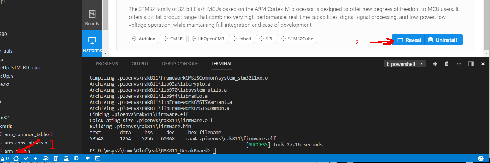

# RAK811 breakout board

Complete instructions here [running in windows](./WINDOWS.md)

Code from here 
https://github.com/RAKWireless/RAK811_BreakBoard
then adapted to platformio

# Add new board definition

The earlier versions of the board only had 16K ram so stm32l15xx6.ld is default as linker script.
If you want to use the full 32K ram you can change this line before copy
        "ldscript": "/home/olof/rak/STM32L151XBA_FLASH.ld"

If you use, platformio ide, press

    1) Home button
    2) Platforms/ST STM32 reveal button

    cp rak811.json ~/.platformio/platforms/ststm32/boards/rak811.json

If you do not have this directory, .platformio/platforms/ststm32 try, 
    
    pio platform install ststm32

# compile
    
    pio run

# To flash firmware with  stm32flash

You can use the platformio, it comes with stlinkv2
Just move the BOOT strap one step, then

    pio run --target upload --upload-port /dev/ttyUSB0

Or if you want in stm32flash_src there is code to flash the device. Build with make

    ./stm32flash -w .pioenvs/rak811/firmware.bin  /dev/ttyUSB0
To reset and start after download, try

    ./stm32flash  -w .pioenvs/rak811/firmware.bin -v -g  0x0  /dev/ttyUSB0

In linux, you can use this command to flash and capture output.
    ./stm32flash  -w .pioenvs/rak811/firmware.bin -v -g  0x0  /dev/ttyUSB0 && pio device monitor --port  /dev/ttyUSB0 --baud 115200
    ./stm32flash  -w .pioenvs/rak811/firmware.bin -v -g  0x0  /dev/ttyUSB0 && screen /dev/ttyUSB0 115200

In windows, try something like this
    pio run --target upload --upload-port COM15
    stm32flash_src/stm32flash.exe -E -w .pioenvs/rak811/firmware.bin COM15    

# Start
Now it starts and outputs debug information on UART,

    Move Detected INT1 src:0x48
    [Debug]: tempr: 35 Bat: 3988mv
    [Debug]: ACC X:FF00 Y:0000 Z:FF00
    GpsGetLatestGpsPositionDouble ret = 0

# Application information

https://os.mbed.com/teams/Semtech/code/LoRaWAN-NAMote72-Application-Demo/

# Qemu
I have made a simple qemu board emulation and its possible to start and run in qemu,
Read more here [running in qemu](./QEMU.md)

# MCU information

    Interface serial_posix: 57600 8E1
    Version      : 0x31
    Option 1     : 0x00
    Option 2     : 0x00
    Device ID    : 0x0429 (STM32L1xxx6(8/B)A)
    - RAM        : 32KiB  (4096b reserved by bootloader)
    - Flash      : 128KiB (size first sector: 16x256)
    - Option RAM : 32b
    - System RAM : 4KiB

http://www.st.com/content/ccc/resource/technical/document/reference_manual/cc/f9/93/b2/f0/82/42/57/CD00240193.pdf/files/CD00240193.pdf/jcr:content/translations/en.CD00240193.pdf

# Building with makefile,
You can checkout the original files and use this makefile to build,
https://raw.githubusercontent.com/oguiter/RAK811_BreakBoard/master/Makefile
I did this and ran the generated elf files in qemu.
Read more amout this experiment here,
Read more here [running in parallell](./parallell_run.md)

# Startup code
The startup code should have been this,
https://github.com/RAKWireless/RAK811_BreakBoard/tree/master/src/boards/RAK811BreakBoard/cmsis/arm-gcc/boards/RAK811BreakBoard/cmsis/startup_stm32l151xb.s

But instead
    .platformio/packages/framework-cmsis/variants/stm32l1/stm32l151xba/startup_stm32l151xba.S
is used,

Only difference is that platformio has removed the call to __libc_init_array
    /*bl __libc_init_array*/ /* PlatformIO note: Will work without -nostartfiles */

Here you can read more about this,
http://cs107e.github.io/guides/gcc/
https://www.embedded.com/design/mcus-processors-and-socs/4026075/Building-Bare-Metal-ARM-Systems-with-GNU-Part-2

The option -nostartfiles instructs the linker to not use the standard system startup functions nor link the code containing those functions.

 The library function __libc_init_array invokes all C++ static constructors (see also the linker script).
 As we do not have any static c++ constructors this should not be a problem, but could be something to think about.
 If you patch the function to call , bl __libc_init_array then you might get an undefined reference to _init.
 https://answers.launchpad.net/gcc-arm-embedded/+question/224709

# Blackmagic Single Wire Debug

Allows flashing over wifi and single step the code with gdb
https://github.com/Ebiroll/esp32_blackmagic
